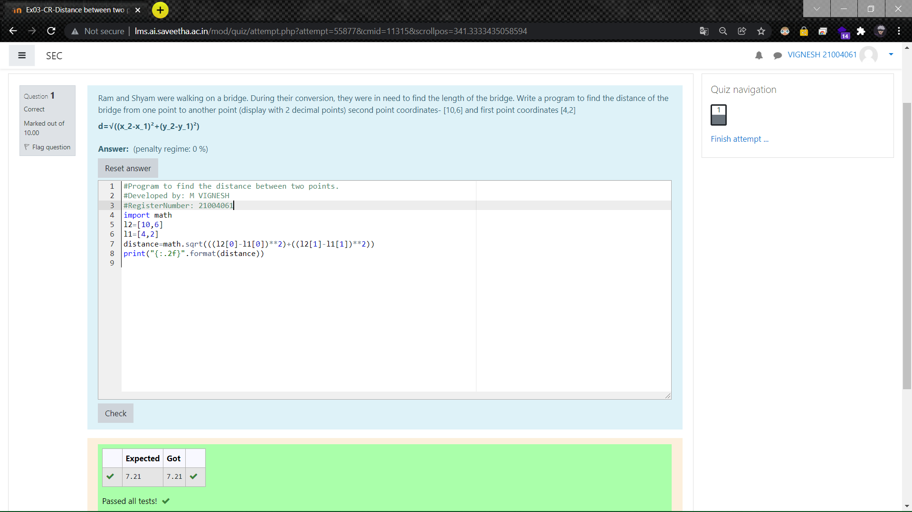

# DISTANCE-BETWEEN-TWO-POINTS

## AIM:
To write a python program to find the distance two 2 points
## ALGORITHM:
### Step 1: 
Import the math module to use mathematical build-in function
### Step 2: 
Initialize the values of 2 points in two different list
### Step 3: 
Substitute the values in the distance formula  
### Step 4: 
Print the distance with two precision.
### Step 5: 
End the program
### PROGRAM:
~~~
#Program to find the distance between two points.
#Developed by: 
#RegisterNumber:
import math
l2=[10,6]
l1=[4,2]
distance=math.sqrt(((l2[0]-l1[0])**2)+((l2[1]-l1[1])**2))
print("{:.2f}".format(distance))
~~~
### OUTPUT:

### RESULT:
Thus the above program to find the distance between two points is successfully executed
